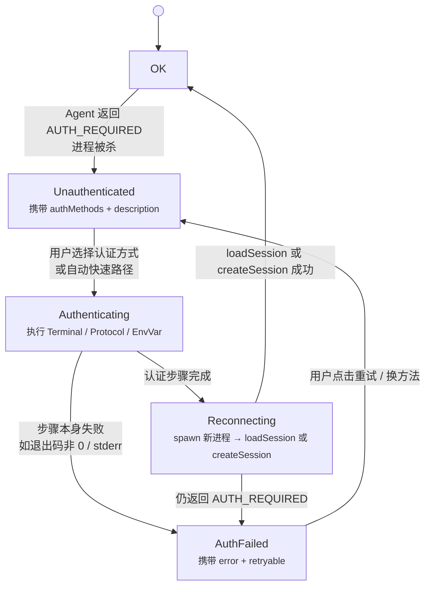
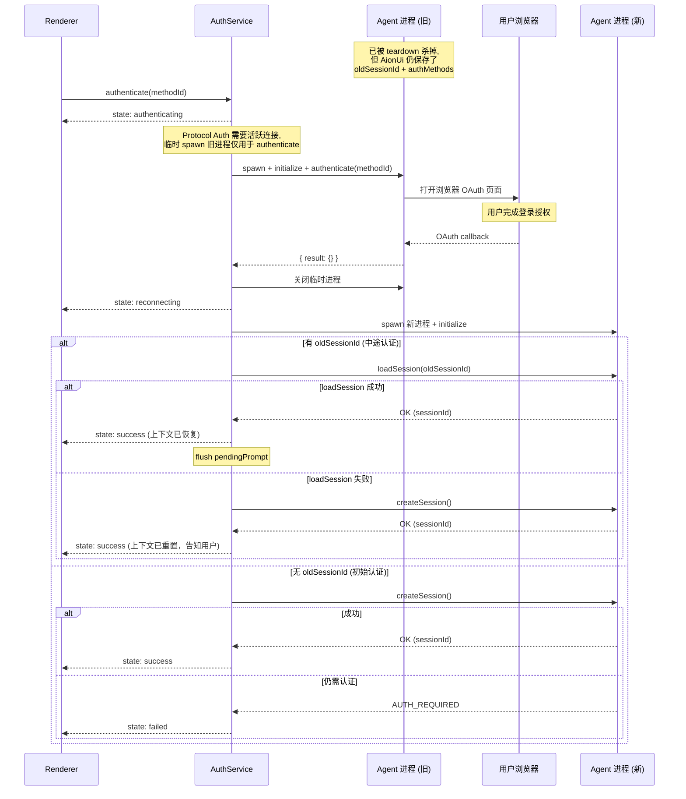
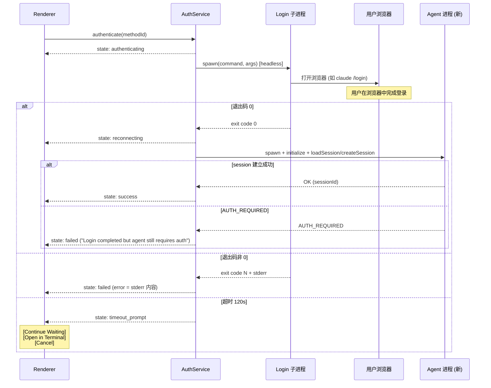
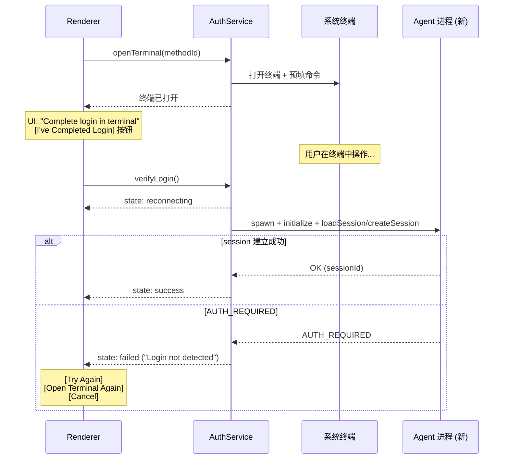
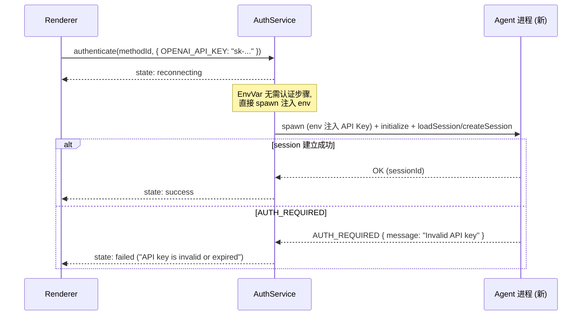

# ACP Agent Auth 重设计方案

> Status: Draft v2
> Date: 2026-04-19
> References: [Zed ACP Auth Flow](../../AionHub/docs/acp-agent-auth-flow-by-zed.md), [ACP Agent Auth Methods Survey](../../AionHub/docs/acp-agent-auth-methods.md)

## 目录

1. [现状与问题](#1-现状与问题)
2. [设计目标](#2-设计目标)
3. [架构总览](#3-架构总览)
4. [AuthMethod 类型与处理策略](#4-authmethod-类型与处理策略)
5. [认证完成感知（核心难题）](#5-认证完成感知核心难题)
6. [Main Process 层设计](#6-main-process-层设计)
7. [IPC Bridge 设计](#7-ipc-bridge-设计)
8. [Renderer UI 设计](#8-renderer-ui-设计)
9. [凭证存储与生命周期](#9-凭证存储与生命周期)
10. [多 Session 共享与上下文保护](#10-多-session-共享与上下文保护)
11. [错误恢复与重新认证](#11-错误恢复与重新认证)
12. [迁移计划](#12-迁移计划)
13. [文件清单](#13-文件清单)

---

## 1. 现状与问题

### 1.1 当前架构

```
SessionLifecycle                  AcpAgentV2 (compat)
  ├─ AuthNegotiator                 ├─ handleAuthRequired()
  │   └─ selectAuthMethod()         │   ├─ runBackendLogin() ← 硬编码 claude/qwen
  │       └─ 仅匹配 env_var 类型    │   └─ loadAuthCredentials() ← shell env
  ├─ 检测 AUTH_REQUIRED             │
  └─ emit auth_required signal      └─ 不传递给 renderer，直接静默处理
```

### 1.2 核心问题

| #   | 问题                                                      | 影响                                             |
| --- | --------------------------------------------------------- | ------------------------------------------------ |
| P1  | `AuthNegotiator.selectAuthMethod()` 仅处理 `env_var` 类型 | Terminal login、OAuth、Device pairing 等均不支持 |
| P2  | `auth_required` 信号从未到达 renderer                     | 用户无法交互式完成认证                           |
| P3  | 无 IPC channel 让 renderer 触发 `retryAuth`               | renderer 侧完全无法参与认证流程                  |
| P4  | `BACKEND_LOGIN_ARGS` 硬编码 2 个 backend                  | 新增 backend 需改代码                            |
| P5  | `authRetryAttempted` 布尔限制仅 1 次重试                  | 用户无法在 UI 上多次尝试                         |
| P6  | `ConfigStorage` 中 `authToken`/`authMethodId` 是死代码    | 无实际持久化                                     |
| P7  | 无 renderer 侧 Auth Modal/Dialog                          | 用户在 UI 上只能看到错误字符串                   |

### 1.3 对标：Zed 的设计原则

1. **Client 不管理凭证** — 认证完全委托给 Agent 进程
2. **被动感知** — 仅通过 `ErrorCode::AuthRequired` 检测认证需求
3. **两条认证路径** — Terminal Auth（打开终端执行登录命令）和 Protocol Auth（发送 `AuthenticateRequest`）
4. **UI 驱动** — 将 `authMethods` 渲染为按钮，用户选择后触发认证

---

## 2. 设计目标

### Must Have (P0)

- 全面支持 ACP 协议的所有 `AuthMethod` 类型（Terminal、Agent/OAuth、EnvVar）
- 新增 Renderer 侧 Auth UI（Modal），支持用户交互式完成认证
- 新增 IPC channel，打通 main ↔ renderer 的认证通信
- 去掉硬编码的 `BACKEND_LOGIN_ARGS`，从 `authMethods` 动态获取信息
- 可靠的认证完成感知机制（成功、失败、失败原因）

### Should Have (P1)

- 允许用户多次重试（去掉 `authRetryAttempted` 限制）
- 支持 "Reauthenticate" 手动触发
- 认证状态跨同一 backend 的多个 conversation 安全共享（不丢失上下文）

### Nice to Have (P2)

- 认证方法偏好记忆
- EnvVar 类型支持在 UI 上直接输入 API Key 并加密存储

### 约束

- **Bridge 只做透传** — Bridge 层禁止任何逻辑，所有认证逻辑在 AuthService 层。Bridge 未来会被 stdio/wss 替代。
- **不存储明文凭证** — 用户输入的 API Key 必须通过 `safeStorage` 加密后存储。

---

## 3. 架构总览

### 3.1 分层架构

```
┌─────────────────────────────────────────────────────────────────────┐
│  Renderer (UI 层)                                                   │
│  AcpAuthModal → AuthMethodSelector → AuthProgress                   │
│  ├─ 展示 authMethods 列表                                           │
│  ├─ 用户选择认证方式                                                │
│  └─ 调用 IPC → 纯透传 → AuthService                                 │
├─────────────────────────────────────────────────────────────────────┤
│  IPC Bridge (纯透传层，禁止逻辑)                                    │
│  acpAuth.* channels — 仅 forward，未来替换为 stdio/wss              │
├─────────────────────────────────────────────────────────────────────┤
│  AuthService (认证业务层，所有逻辑在此)                             │
│  ├─ AuthMethodResolver   → 决定认证策略                             │
│  ├─ AuthExecutor         → 策略模式执行认证                         │
│  │   ├─ TerminalAuthExecutor   → headless spawn / 外部终端          │
│  │   ├─ ProtocolAuthExecutor   → protocol.authenticate(methodId)    │
│  │   └─ EnvVarAuthExecutor     → 环境变量检查/注入                  │
│  ├─ AuthVerifier         → 通过 retry createSession 验证认证结果    │
│  └─ AuthStateManager     → 跨 conversation 状态管理 + 广播          │
├─────────────────────────────────────────────────────────────────────┤
│  SessionLifecycle (会话层)                                          │
│  AuthNegotiator (重构: 快速路径 + 报告 UI)                          │
└─────────────────────────────────────────────────────────────────────┘
          │
          ▼ (JSON-RPC over stdio)
┌─────────────────────────────────────────────────────────────────────┐
│  Agent 进程 — 自行管理凭证存储、Token 刷新、登录交互                │
└─────────────────────────────────────────────────────────────────────┘
```

### 3.2 核心设计原则

1. **AionUi 不管理 Agent 凭证** — 凭证由 Agent 进程管理
2. **UI 驱动认证** — `auth_required` 信号到达 renderer，用户在 Modal 中选择方式并触发
3. **快速路径** — `env_var` 凭证已存在于环境变量时自动完成，无需弹 Modal
4. **Bridge 纯透传** — Bridge 层零逻辑，所有逻辑在 AuthService
5. **retry createSession 是唯一可靠的仲裁** — 不依赖子进程退出码或 authenticate() 返回值作为最终判定

### 3.3 认证状态机



关键状态：**Reconnecting**。认证步骤完成后，spawn 新 Agent 进程重新建立 session。
- 如有 `oldSessionId` → 先尝试 `loadSession(oldSessionId)` 恢复上下文
- `loadSession` 不支持或失败 → fallback 到 `createSession`（上下文丢失，告知用户）
- 仍返回 `AUTH_REQUIRED` → 认证实际未成功，进入 AuthFailed 让用户重试

---

## 4. AuthMethod 类型与处理策略

基于对 16 个 ACP Agent 的调研：

### 4.1 类型分类

| AuthMethod 类型           | 识别方式                                             | 处理策略                           | 典型 Agent                                    |
| ------------------------- | ---------------------------------------------------- | ---------------------------------- | --------------------------------------------- |
| **Terminal**              | `type === 'terminal'` 或 `_meta.type === 'terminal'` | Headless spawn / 外部终端          | pi, qwen                                      |
| **Agent (OAuth/Browser)** | 无 `type` 字段，或 `type` 不是 `terminal`/`env_var`  | `protocol.authenticate(methodId)`  | copilot, gemini, codex(chatgpt), iflow, droid |
| **EnvVar**                | `type === 'env_var'` + `vars[]`                      | 自动匹配 env / UI 引导输入         | codex, iflow                                  |
| **Empty**                 | `authMethods: []`                                    | fallback 到已知 env key / 通用提示 | claude-agent-acp                              |

### 4.2 Terminal Auth — 两级策略

不做内嵌终端。采用 **headless 优先 + 外部终端兜底** 的两级策略：

#### Tier 1: Headless Spawn（大多数情况）

大部分 "terminal login" 命令其实不需要真正的终端交互 — 它们执行后自动打开浏览器完成 OAuth，然后退出。

```
1. Main process spawn 子进程 (stdio: 'pipe', 不需要 TTY)
2. 捕获 stdout/stderr 用于诊断
3. 监听退出码:
   - 退出码 0 → 登录步骤完成 → 进入 Reconnecting
   - 退出码非 0 → 登录步骤失败，携带 stderr 作为错误信息
   - 超时 (120s) → 可能需要交互，提示用户切换到外部终端
4. Reconnecting: spawn 新进程 → loadSession / createSession
```

UI 状态：Modal 显示 "Logging in..." + spinner + "Waiting for browser authentication"

#### Tier 2: 外部终端（兜底）

当 Headless 超时或用户手动选择时：

```
1. 构建完整命令字符串 (如 "claude /login")
2. 打开系统默认终端:
   - macOS: open -a Terminal.app 并执行命令
   - Linux: x-terminal-emulator -e "..."
   - Windows: start cmd /k "..."
3. 命令已预填好，用户在终端中操作
4. UI 显示 "Complete login in the terminal" + [I've Completed Login] 按钮
5. 用户点击按钮 → Reconnecting: spawn 新进程 → loadSession / createSession
6. 失败 → "Login not detected. Try again?" + [Retry] / [Open Terminal Again]
```

#### 为什么不做内嵌终端

- 复杂度高：需要 xterm.js + IPC stdio 管道 + 终端尺寸同步
- 大部分 terminal login 命令不需要用户在终端中输入（自动打开浏览器）
- 真正需要交互的场景，外部终端体验更好（用户熟悉的环境）

### 4.3 Protocol Auth（OAuth、Browser、Device Pairing）

```
Agent 声明:
  { id: "github_oauth", name: "Sign in with GitHub", description: "..." }

处理流程:
  1. Renderer 展示按钮 "Sign in with GitHub"
  2. 用户点击 → IPC (纯透传) → AuthService
  3. AuthService 调用 protocol.authenticate(methodId)
     - Agent 进程自行处理（打开浏览器、设备配对等）
     - 这个 JSON-RPC call 会 block 直到 Agent 完成或超时
     - Agent 返回 result → 登录步骤完成
     - Agent 返回 error → 登录步骤失败，携带 error.message
  4. 登录步骤完成 → Reconnecting: spawn 新进程 → loadSession / createSession
```

### 4.4 EnvVar Auth

```
快速路径 (静默):
  1. 检查 shell 环境中是否已有所需变量
  2. 如有 → 直接进入 Reconnecting: spawn 新进程 (注入 env) → createSession

交互路径 (快速路径失败):
  1. Renderer 展示 "Use OPENAI_API_KEY" 按钮 + 输入框
  2. 用户输入 API Key → 加密存储到 safeStorage
  3. Reconnecting: spawn 新进程 (注入 env) → createSession
```

### 4.5 Empty authMethods

```
authMethods: [] 但收到 AUTH_REQUIRED:
  1. 查找 BACKEND_AUTH_KEYS 中该 backend 的已知 key
  2. 如有 → 尝试从 env 加载并 retry
  3. 如无 → 展示通用提示 "Please configure authentication for {agent}"
```

### 4.6 认证方式选择逻辑 (AuthMethodResolver)

```typescript
type AuthResolution =
  | { strategy: 'auto_env_var'; method: AuthMethod }       // 静默，不弹 Modal
  | { strategy: 'single_method'; method: AuthMethod }      // 可能需要 UI
  | { strategy: 'user_choice'; methods: AuthMethod[] }     // 必须弹 Modal
  | { strategy: 'no_methods' }                             // 无方法可用

class AuthMethodResolver {
  /**
   * 优先级:
   * 1. env_var 类型 + 环境变量已存在 → auto_env_var (静默)
   * 2. 仅 1 个方法 → single_method
   * 3. 多个方法 → user_choice (弹 Modal)
   * 4. 无方法 → no_methods
   */
  resolve(methods: AuthMethod[], credentials?: Record<string, string>): AuthResolution;
}
```

---

## 5. 认证完成感知（核心难题）

### 5.1 问题本质

认证过程分两步：
1. **登录步骤** — 用户在浏览器/终端/输入框完成操作
2. **Agent 接受** — Agent 进程确认凭证有效，`createSession()` 不再返回 `AUTH_REQUIRED`

步骤 1 完成 **不等于** 步骤 2 成功。例如：
- 终端退出码 0 但 token 实际已过期
- OAuth 浏览器回调成功但 Agent 检测到 scope 不足
- API Key 格式正确但已被 revoke

### 5.2 解决方案：认证 + Reconnect 一体化

认证完成后，直接 spawn 新 Agent 进程建立正式 session。这个新进程不是一次性探针，**就是后续要用的进程**。
loadSession / createSession 的结果既是「认证是否成功」的判定，也是「正式 session 建立」的动作，二合一。

**初始认证（首次 createSession 就 AUTH_REQUIRED）**：

```
spawn → createSession → AUTH_REQUIRED → 进程被杀 → 用户完成认证
  → spawn 新进程 → initialize → createSession
    → 成功 → 正常使用
    → AUTH_REQUIRED → 认证没成功，让用户重试
```

无上下文可丢失，直接 `createSession` 即可。

**中途认证（已有活跃 session，prompt 时 AUTH_REQUIRED）**：

```
session 活跃 → prompt → AUTH_REQUIRED → 进程被杀 (pendingPrompt 已暂存)
  → 用户完成认证
  → spawn 新进程 → initialize
    → loadSession(oldSessionId)
      → 成功 → 上下文恢复 → flush pendingPrompt
      → 失败 (不支持 resume 或 session 已过期)
        → createSession → 告知用户上下文已重置 → flush pendingPrompt
    → AUTH_REQUIRED → 认证没成功，让用户重试
```

优先 `loadSession` 恢复上下文。Agent 是否支持取决于 `sessionCapabilities.resume`。

**Reconnect 逻辑**（统一用于所有认证类型）：

```typescript
// src/process/acp/auth/AuthService.ts — reconnect 部分

async reconnect(
  agentConfig: AgentConfig,
  oldSessionId: string | null,
  credentials?: Record<string, string>,
): Promise<ReconnectResult> {
  // 1. Spawn 新 Agent 进程
  const client = this.clientFactory.create(agentConfig, credentials);
  const initResult = await client.start();

  // 2. 中途认证：尝试 loadSession 恢复上下文
  if (oldSessionId) {
    try {
      const loaded = await client.loadSession(oldSessionId);
      return { success: true, client, sessionId: loaded.sessionId, contextRestored: true };
    } catch {
      // loadSession 失败，fallback 到 createSession
    }
  }

  // 3. createSession（初始认证，或 loadSession 失败的 fallback）
  try {
    const session = await client.createSession({ cwd: agentConfig.cwd });
    return {
      success: true,
      client,
      sessionId: session.sessionId,
      contextRestored: false, // 初始认证或 loadSession 失败
    };
  } catch (err) {
    const normalized = normalizeError(err);
    if (normalized.code === 'AUTH_REQUIRED') {
      client.close();
      return { success: false, reason: 'still_unauthorized', error: normalized.message };
    }
    client.close();
    return { success: false, reason: 'connection_error', error: normalized.message };
  }
}

type ReconnectResult =
  | { success: true; client: AcpClient; sessionId: string; contextRestored: boolean }
  | { success: false; reason: 'still_unauthorized' | 'connection_error'; error: string };
```

### 5.3 各认证类型的完整链路

#### Protocol Auth



#### Terminal Auth (Headless)



#### Terminal Auth (外部终端) — "I've Completed Login"



#### EnvVar Auth



### 5.4 错误信息来源

| 阶段                            | 错误来源                                        | 信息质量                      |
| ------------------------------- | ----------------------------------------------- | ----------------------------- |
| `authenticate()` 失败           | Agent JSON-RPC error: `{ code, message }`       | 高 — Agent 直接告诉你原因     |
| Terminal 退出码非 0             | stderr 输出                                     | 中 — 取决于 CLI 实现          |
| Terminal 超时                   | 我们自己的超时逻辑                              | 低 — 只知道超时了             |
| `loadSession()` 失败            | Agent error 或不支持 resume                     | 中 — 可能只是不支持           |
| `createSession()` AUTH_REQUIRED | Agent JSON-RPC error: `{ code, message, data }` | 高 — Agent 告诉你为什么不接受 |
| `createSession()` 其他错误      | 连接/协议错误                                   | 中 — 网络/进程层面的错误      |

所有错误信息都透传给 renderer，由 UI 直接展示。AuthService 不吃掉或改写错误信息。

### 5.5 Protocol Auth 的特殊处理

Protocol Auth 需要活跃的 ACP 连接才能调用 `authenticate(methodId)`。但收到 AUTH_REQUIRED 时进程已被杀。

**解决方案**：临时 spawn 一个进程，仅用于 `authenticate()` 调用，完成后关闭。然后进入统一的 Reconnecting 流程。

```
AUTH_REQUIRED → 进程被杀 → 用户选择 Protocol Auth
  → 临时 spawn 进程 → initialize → authenticate(methodId)
    → Agent 打开浏览器/设备配对 → 用户操作 → Agent 返回 OK
  → 关闭临时进程
  → Reconnecting: spawn 正式新进程 → loadSession / createSession
```

为什么不复用临时进程直接 createSession？因为 `authenticate()` 只保证该进程实例的凭证刷新。重新 spawn 一个干净进程更可靠，且与 Terminal/EnvVar 路径的行为一致。

对于 Terminal Auth 和 EnvVar Auth，认证步骤不需要 ACP 连接（spawn 独立登录命令 / 设置 env），无此问题。

---

## 6. Main Process 层设计

### 6.1 模块结构

```
src/process/acp/auth/
├── AuthMethodResolver.ts         # 认证方式选择逻辑
├── AuthService.ts                # 认证业务入口 (所有逻辑在此)
├── AuthStateManager.ts           # 跨 conversation 状态管理
├── executors/
│   ├── TerminalAuthExecutor.ts   # Terminal 认证 (headless + 外部终端)
│   ├── ProtocolAuthExecutor.ts   # Protocol 认证
│   └── EnvVarAuthExecutor.ts     # EnvVar 认证
└── types.ts                      # Auth 模块类型定义
```

### 6.2 AuthService — 业务逻辑总入口

Bridge 层禁止逻辑，所有认证逻辑集中在 AuthService：

```typescript
// src/process/acp/auth/AuthService.ts

class AuthService {
  constructor(
    private readonly stateManager: AuthStateManager,
    private readonly clientFactory: ConnectorFactory,
    private readonly executors: IAuthExecutor[],
    private readonly emitter: AuthEventEmitter,
  ) {}

  /**
   * 用户选择了某个认证方式，执行完整流程:
   * 1. 执行认证步骤 (Terminal/Protocol/EnvVar)
   * 2. Reconnect: spawn 新进程 → loadSession / createSession
   */
  async authenticate(request: AuthenticateRequest): Promise<AuthenticateResponse> {
    const { conversationId, methodId, method, agentConfig, oldSessionId } = request;

    // 1. 通知 renderer: authenticating
    this.emitter.emitStateChange(conversationId, {
      status: 'authenticating',
      methodId,
      methodName: method.name,
    });

    // 2. 找到匹配的 executor 并执行
    const executor = this.executors.find(e => e.canHandle(method));
    if (!executor) {
      return this.fail(conversationId, 'No handler for this auth method', false);
    }

    const stepResult = await executor.execute({ conversationId, method, agentConfig });
    if (!stepResult.success) {
      return this.fail(conversationId, stepResult.error, stepResult.retryable);
    }

    // 3. Reconnect: spawn 新进程 → loadSession / createSession
    return this.reconnectAndReport(conversationId, agentConfig, oldSessionId);
  }

  /**
   * Terminal Auth 外部终端: 用户点击 "I've Completed Login" 后调用。
   * 跳过认证步骤，直接 reconnect。
   */
  async verifyManualLogin(
    conversationId: string,
    agentConfig: AgentConfig,
    oldSessionId: string | null,
  ): Promise<AuthenticateResponse> {
    return this.reconnectAndReport(conversationId, agentConfig, oldSessionId);
  }

  /**
   * 统一的 reconnect 逻辑 — 认证步骤完成后调用。
   * spawn 的新进程就是后续正式使用的进程。
   */
  private async reconnectAndReport(
    conversationId: string,
    agentConfig: AgentConfig,
    oldSessionId: string | null,
  ): Promise<AuthenticateResponse> {
    this.emitter.emitStateChange(conversationId, { status: 'reconnecting' });

    const result = await this.reconnect(agentConfig, oldSessionId);

    if (!result.success) {
      return this.fail(conversationId, result.error, true);
    }

    // 通知状态 + 是否上下文恢复
    this.stateManager.onAuthSuccess(agentConfig.agentBackend);
    this.emitter.emitStateChange(conversationId, {
      status: 'success',
      contextRestored: result.contextRestored,
    });

    return {
      success: true,
      sessionId: result.sessionId,
      client: result.client,
      contextRestored: result.contextRestored,
    };
  }

  private async reconnect(
    agentConfig: AgentConfig,
    oldSessionId: string | null,
  ): Promise<ReconnectResult> {
    const client = this.clientFactory.create(agentConfig);
    await client.start();

    // 中途认证: 尝试 loadSession 恢复上下文
    if (oldSessionId) {
      try {
        const loaded = await client.loadSession(oldSessionId);
        return { success: true, client, sessionId: loaded.sessionId, contextRestored: true };
      } catch {
        // loadSession 失败，fallback 到 createSession
      }
    }

    // createSession
    try {
      const session = await client.createSession({ cwd: agentConfig.cwd });
      return { success: true, client, sessionId: session.sessionId, contextRestored: false };
    } catch (err) {
      const normalized = normalizeError(err);
      client.close();
      return {
        success: false,
        reason: normalized.code === 'AUTH_REQUIRED' ? 'still_unauthorized' : 'connection_error',
        error: normalized.message,
      };
    }
  }

  /** 打开外部终端执行命令 (不等待结果) */
  async openExternalTerminal(request: OpenTerminalRequest): Promise<void> {
    const { command, args, env } = request;
    const fullCommand = [command, ...args].join(' ');

    if (process.platform === 'darwin') {
      spawn('open', ['-a', 'Terminal.app', fullCommand]); // 简化示意
    } else if (process.platform === 'linux') {
      spawn('x-terminal-emulator', ['-e', fullCommand]);
    } else {
      spawn('cmd', ['/k', fullCommand], { shell: true });
    }
  }

  private fail(convId: string, error: string, retryable: boolean): AuthenticateResponse {
    this.emitter.emitStateChange(convId, { status: 'failed', error, retryable });
    return { success: false, error, retryable };
  }
}
```

### 6.3 AuthExecutor 接口

```typescript
// src/process/acp/auth/types.ts

type AuthExecuteRequest = {
  conversationId: string;
  method: AuthMethod;
  /** ACP client (仅 Protocol Auth 需要) */
  protocol?: { authenticate(methodId: string): Promise<unknown> };
  /** Agent 配置 (Terminal Auth 需要构建命令) */
  agentConfig: AgentConfig;
};

type AuthStepResult =
  | { success: true }
  | { success: false; error: string; retryable: boolean };

interface IAuthExecutor {
  canHandle(method: AuthMethod): boolean;
  /** 执行认证步骤。成功仅表示「步骤完成」，不表示 Agent 已接受。 */
  execute(request: AuthExecuteRequest): Promise<AuthStepResult>;
  cancel(): void;
}
```

### 6.4 TerminalAuthExecutor

```typescript
class TerminalAuthExecutor implements IAuthExecutor {
  private process: ChildProcess | null = null;

  canHandle(method: AuthMethod): boolean {
    return this.parseTerminalConfig(method) !== null;
  }

  async execute(request: AuthExecuteRequest): Promise<AuthStepResult> {
    const config = this.parseTerminalConfig(request.method);
    if (!config) return { success: false, error: 'Invalid terminal auth config', retryable: false };

    const command = this.buildCommand(config, request.agentConfig);
    const stderr: string[] = [];

    return new Promise((resolve) => {
      this.process = spawn(command.program, command.args, {
        stdio: 'pipe',
        env: { ...process.env, ...command.env },
        timeout: 120_000,
      });

      this.process.stderr?.on('data', (chunk) => stderr.push(chunk.toString()));

      this.process.on('close', (code) => {
        this.process = null;
        if (code === 0) {
          resolve({ success: true });
        } else {
          resolve({
            success: false,
            error: stderr.join('') || `Login exited with code ${code}`,
            retryable: true,
          });
        }
      });

      this.process.on('error', (err) => {
        this.process = null;
        resolve({
          success: false,
          error: `Failed to execute login: ${err.message}`,
          retryable: true,
        });
      });
    });
  }

  cancel(): void {
    this.process?.kill();
    this.process = null;
  }

  private parseTerminalConfig(method: AuthMethod): TerminalConfig | null {
    // 1. type === 'terminal' → 顶层 args/env
    // 2. _meta.type === 'terminal' + _meta.args → qwen 风格
    // 3. _meta['terminal-auth'] → Zed legacy 兼容
  }
}
```

### 6.5 ProtocolAuthExecutor

```typescript
class ProtocolAuthExecutor implements IAuthExecutor {
  canHandle(method: AuthMethod): boolean {
    return !('type' in method) || (method.type !== 'terminal' && method.type !== 'env_var');
  }

  async execute(request: AuthExecuteRequest): Promise<AuthStepResult> {
    if (!request.protocol) {
      return { success: false, error: 'No active connection for protocol auth', retryable: true };
    }

    try {
      await request.protocol.authenticate(request.method.id);
      return { success: true };
    } catch (err) {
      // 透传 Agent 返回的错误信息
      const message = err instanceof Error ? err.message : String(err);
      return { success: false, error: message, retryable: true };
    }
  }

  cancel(): void {
    // Protocol auth 由 Agent 进程控制，无法 cancel
  }
}
```

### 6.6 重构 AuthNegotiator

```typescript
class AuthNegotiator {
  private credentials: Record<string, string> | null = null;
  private readonly resolver = new AuthMethodResolver();

  /**
   * 尝试快速路径。
   * 成功 → 返回 'authenticated'
   * 失败 → 返回 AuthRequiredData，由上层传递给 renderer
   */
  async tryFastPath(
    protocol: { authenticate(methodId: string): Promise<unknown> },
    authMethods: AuthMethod[]
  ): Promise<'authenticated' | AuthRequiredData> {
    const resolution = this.resolver.resolve(authMethods, this.credentials ?? undefined);

    if (resolution.strategy === 'auto_env_var') {
      try {
        await protocol.authenticate(resolution.method.id);
        return 'authenticated';
      } catch {
        // 快速路径失败，fallback 到 UI
      }
    }

    return {
      agentBackend: this.agentBackend,
      methods: authMethods,
    };
  }
}
```

### 6.7 重构 SessionLifecycle

```typescript
private async establishSession(): Promise<NewSessionResponse | LoadSessionResponse | null> {
  try {
    return await this.createOrLoadSession();
  } catch (err) {
    const normalized = normalizeError(err);
    if (normalized.code === 'AUTH_REQUIRED') {
      const result = await this.authNegotiator.tryFastPath(
        this._client!,
        this.cachedAuthMethods ?? []
      );

      if (result === 'authenticated') {
        return await this.createOrLoadSession();
      }

      // 快速路径失败 → 通知 UI
      this.authPending = true;
      // Protocol Auth 需要保持连接用于后续 authenticate() 调用
      // Terminal/EnvVar Auth 不需要，但保持也无害
      this.host.callbacks.onSignal({
        type: 'auth_required',
        auth: result,
      });
      return null;
    }
    throw err;
  }
}
```

---

## 7. IPC Bridge 设计

### 7.1 核心原则：纯透传

Bridge 层即将被 stdio/wss 替代。**禁止在 bridge 中放任何逻辑**。Bridge 的 handler 只做：

```typescript
// 正确 — 纯透传
handle(request) → forward to AuthService → return result

// 错误 — 禁止
handle(request) → validate → transform → call multiple services → aggregate → return
```

### 7.2 新增 IPC Channels

```typescript
// src/common/adapter/ipcBridge.ts — 新增 acpAuth section

export const acpAuth = {
  /** main → renderer: Agent 需要认证 */
  onAuthRequired: bridge.buildEmitter<AcpAuthRequiredEvent>('acp.auth.required'),

  /** main → renderer: 认证状态变更 */
  onAuthStateChange: bridge.buildEmitter<AcpAuthStateChangeEvent>('acp.auth.state-change'),

  /** renderer → main: 执行认证 */
  authenticate: bridge.buildProvider<AcpAuthenticateRequest, AcpAuthenticateResponse>(
    'acp.auth.authenticate'
  ),

  /** renderer → main: 打开外部终端 (Terminal Auth Tier 2) */
  openTerminal: bridge.buildProvider<AcpOpenTerminalRequest, void>('acp.auth.open-terminal'),

  /** renderer → main: 用户确认已在外部终端完成登录，触发 verify */
  verifyLogin: bridge.buildProvider<AcpVerifyLoginRequest, AcpAuthenticateResponse>(
    'acp.auth.verify-login'
  ),

  /** renderer → main: 取消认证 */
  cancelAuth: bridge.buildProvider<{ conversationId: string }, void>('acp.auth.cancel'),

  /** renderer → main: 手动触发重新认证 */
  reauthenticate: bridge.buildProvider<{ conversationId: string }, void>(
    'acp.auth.reauthenticate'
  ),
};
```

### 7.3 IPC 类型定义

```typescript
// src/common/types/acpAuthTypes.ts

/** main → renderer: 认证需求事件 */
type AcpAuthRequiredEvent = {
  conversationId: string;
  agentBackend: string;
  methods: AcpAuthMethodUI[];
  description?: string;
};

/** 面向 UI 的认证方法 */
type AcpAuthMethodUI = {
  id: string;
  name: string;
  description?: string;
  /** 决定 UI 展示方式和图标 */
  uiType: 'terminal' | 'oauth' | 'env_var' | 'device_pairing' | 'generic';
  /** env_var 所需的环境变量名 */
  requiredVars?: string[];
  /** 是否已有凭证 */
  credentialsReady?: boolean;
};

/** renderer → main: 执行认证 */
type AcpAuthenticateRequest = {
  conversationId: string;
  methodId: string;
  /** 用户输入的凭证 (env_var 类型) */
  userCredentials?: Record<string, string>;
};

/** renderer → main: 打开外部终端 */
type AcpOpenTerminalRequest = {
  conversationId: string;
  methodId: string;
};

/** renderer → main: 验证手动登录 */
type AcpVerifyLoginRequest = {
  conversationId: string;
};

/** main → renderer: 认证响应 */
type AcpAuthenticateResponse = {
  success: boolean;
  error?: string;
  retryable?: boolean;
};

/** main → renderer: 认证状态变更 */
type AcpAuthStateChangeEvent = {
  conversationId: string;
  agentBackend: string;
  state:
    | { status: 'authenticating'; methodId: string; methodName: string }
    | { status: 'reconnecting' }
    | { status: 'success'; contextRestored?: boolean }
    | { status: 'failed'; error: string; retryable: boolean };
};
```

### 7.4 Bridge Handler — 纯透传示例

```typescript
// src/process/bridge/acpAuthBridge.ts

export function registerAcpAuthBridge(authService: AuthService): void {
  // 纯透传 — 零逻辑
  ipcBridge.acpAuth.authenticate.handle(
    (req) => authService.authenticate(req)
  );

  ipcBridge.acpAuth.openTerminal.handle(
    (req) => authService.openExternalTerminal(req)
  );

  ipcBridge.acpAuth.verifyLogin.handle(
    (req) => authService.verifyManualLogin(req.conversationId)
  );

  ipcBridge.acpAuth.cancelAuth.handle(
    (req) => authService.cancelAuth(req.conversationId)
  );

  ipcBridge.acpAuth.reauthenticate.handle(
    (req) => authService.reauthenticate(req.conversationId)
  );
}
```

---

## 8. Renderer UI 设计

### 8.1 组件结构

```
src/renderer/components/auth/
├── AcpAuthModal.tsx          # 认证 Modal 主组件
├── AuthMethodList.tsx        # 认证方式列表
├── AuthMethodCard.tsx        # 单个认证方式卡片
├── AuthProgress.tsx          # 认证/验证进度
├── TerminalAuthView.tsx      # Terminal Auth 专用视图 (外部终端 + 确认按钮)
├── EnvVarAuthForm.tsx        # API Key 输入表单
└── useAcpAuth.ts             # Auth 状态管理 hook
```

### 8.2 UI 状态流转

**状态: required — 方法选择**

```
┌───────────────────────────────────────────────┐
│  Authentication Required                      │
│                                               │
│  Codex requires authentication.               │
│                                               │
│  Choose an authentication method:             │
│                                               │
│  ┌─────────────────────────────────────────┐  │
│  │ Login with ChatGPT                      │  │
│  │ Use your ChatGPT login (requires paid   │  │
│  │ subscription)                           │  │
│  └─────────────────────────────────────────┘  │
│                                               │
│  ┌─────────────────────────────────────────┐  │
│  │ Use OPENAI_API_KEY           [Ready]    │  │
│  │ Set via environment variable            │  │
│  └─────────────────────────────────────────┘  │
│                                               │
│  ┌─────────────────────────────────────────┐  │
│  │ Use CODEX_API_KEY                       │  │
│  │ Set via environment variable            │  │
│  └─────────────────────────────────────────┘  │
│                                               │
│                               [Cancel]        │
└───────────────────────────────────────────────┘
```

单方法简化：

```
┌───────────────────────────────────────────────┐
│  Authentication Required                      │
│                                               │
│  GitHub Copilot requires authentication.      │
│                                               │
│        [Sign in with GitHub]                  │
│                                               │
│                               [Cancel]        │
└───────────────────────────────────────────────┘
```

**状态: authenticating — Protocol Auth 进行中**

```
┌───────────────────────────────────────────────┐
│  Authenticating...                            │
│                                               │
│  Signing in with GitHub...                    │
│  Waiting for browser authentication           │
│                                               │
│  [===-------]                                 │
│                                               │
│                               [Cancel]        │
└───────────────────────────────────────────────┘
```

**状态: authenticating — Terminal Auth (headless) 进行中**

```
┌───────────────────────────────────────────────┐
│  Logging in...                                │
│                                               │
│  Running login command...                     │
│  A browser window may open for authentication │
│                                               │
│  [===-------]                                 │
│                                               │
│  [Open in Terminal Instead]       [Cancel]    │
└───────────────────────────────────────────────┘
```

**状态: authenticating — Terminal Auth (外部终端)**

```
┌──────────────────────────────────────────────┐
│  Complete Login in Terminal                  │
│                                              │
│  A terminal window has been opened with the  │
│  login command. Please complete the login    │
│  process there.                              │
│                                              │
│  Command: claude /login                      │
│                                              │
│  [I've Completed Login]                      │
│  [Open Terminal Again]            [Cancel]   │
└──────────────────────────────────────────────┘
```

**状态: reconnecting**

```
┌───────────────────────────────────────────────┐
│  Reconnecting...                              │
│                                               │
│  Establishing session with agent...           │
│                                               │
│  [===-------]                                 │
└───────────────────────────────────────────────┘
```

**状态: failed**

```
┌───────────────────────────────────────────────┐
│  Authentication Failed                        │
│                                               │
│  Agent still requires authentication after    │
│  login. The token may be invalid or expired.  │
│                                               │
│  Error: OAuth scope insufficient for this     │
│  operation                                    │
│                                               │
│  [Try Again]          [Try Another Method]    │
│                               [Cancel]        │
└───────────────────────────────────────────────┘
```

### 8.3 useAcpAuth Hook

```typescript
type AcpAuthState =
  | { status: 'idle' }
  | { status: 'required'; event: AcpAuthRequiredEvent }
  | { status: 'authenticating'; methodId: string; methodName: string }
  | { status: 'terminal_waiting'; methodId: string; command: string }  // 外部终端模式
  | { status: 'reconnecting' }
  | { status: 'success' }
  | { status: 'failed'; error: string; retryable: boolean; event?: AcpAuthRequiredEvent };

function useAcpAuth(conversationId: string) {
  const [state, setState] = useState<AcpAuthState>({ status: 'idle' });
  const lastEventRef = useRef<AcpAuthRequiredEvent | null>(null);

  useEffect(() => {
    const unsub1 = ipcBridge.acpAuth.onAuthRequired.on((event) => {
      if (event.conversationId === conversationId) {
        lastEventRef.current = event;
        setState({ status: 'required', event });
      }
    });

    const unsub2 = ipcBridge.acpAuth.onAuthStateChange.on((event) => {
      if (event.conversationId !== conversationId) return;
      const { state: s } = event;
      switch (s.status) {
        case 'authenticating':
          setState({ status: 'authenticating', methodId: s.methodId, methodName: s.methodName });
          break;
        case 'reconnecting':
          setState({ status: 'reconnecting' });
          break;
        case 'success':
          setState({ status: 'success' });
          setTimeout(() => setState({ status: 'idle' }), 1500);
          break;
        case 'failed':
          setState({
            status: 'failed',
            error: s.error,
            retryable: s.retryable,
            event: lastEventRef.current ?? undefined,
          });
          break;
      }
    });

    return () => { unsub1(); unsub2(); };
  }, [conversationId]);

  const authenticate = useCallback(
    (methodId: string, userCredentials?: Record<string, string>) =>
      ipcBridge.acpAuth.authenticate.invoke({ conversationId, methodId, userCredentials }),
    [conversationId]
  );

  const openTerminal = useCallback(
    (methodId: string) =>
      ipcBridge.acpAuth.openTerminal.invoke({ conversationId, methodId }),
    [conversationId]
  );

  const verifyLogin = useCallback(
    () => ipcBridge.acpAuth.verifyLogin.invoke({ conversationId }),
    [conversationId]
  );

  const cancel = useCallback(() => {
    ipcBridge.acpAuth.cancelAuth.invoke({ conversationId });
    setState({ status: 'idle' });
  }, [conversationId]);

  const retry = useCallback(() => {
    if (lastEventRef.current) {
      setState({ status: 'required', event: lastEventRef.current });
    }
  }, []);

  return { state, authenticate, openTerminal, verifyLogin, cancel, retry };
}
```

---

## 9. 凭证存储与生命周期

### 9.1 核心原则：AionUi 不存储 Agent 凭证

Agent 进程继承用户 `HOME`，凭证写入 `~/.claude/`、`~/.config/gemini/` 等。

### 9.2 唯一例外：用户手动输入的 API Key

对于 EnvVar 类型，用户在 UI 上输入的 API Key 需要持久化（否则每次重启都要重新输入）。

**加密方案：使用 Electron safeStorage**

```typescript
// src/process/utils/secureCredentialStore.ts

import { safeStorage } from 'electron';

class SecureCredentialStore {
  private readonly storageKey = 'acp.auth.credentials';

  /** 加密存储 API Key */
  async store(backend: string, key: string, value: string): Promise<void> {
    if (!safeStorage.isEncryptionAvailable()) {
      throw new Error('System encryption not available');
    }
    const encrypted = safeStorage.encryptString(value);
    // 存储 encrypted Buffer 到 ConfigStorage (以 base64 形式)
    const existing = await ProcessConfig.get(this.storageKey) ?? {};
    existing[`${backend}.${key}`] = encrypted.toString('base64');
    await ProcessConfig.set(this.storageKey, existing);
  }

  /** 解密读取 API Key */
  async retrieve(backend: string, key: string): Promise<string | null> {
    const stored = await ProcessConfig.get(this.storageKey);
    const encoded = stored?.[`${backend}.${key}`];
    if (!encoded) return null;
    const buffer = Buffer.from(encoded, 'base64');
    return safeStorage.decryptString(buffer);
  }

  /** 删除 */
  async remove(backend: string, key: string): Promise<void> { ... }
}
```

底层机制：
- **macOS**: Keychain (AES-256)
- **Windows**: DPAPI
- **Linux**: libsecret / kwallet

fallback（safeStorage 不可用时）：拒绝存储，提示用户设置环境变量。

### 9.3 存储的元数据

```typescript
type AuthMetadata = {
  lastMethodId?: string;    // 上次成功使用的方法
  lastAuthTime?: number;    // 上次认证时间
};
// 存储在 ConfigStorage: acp.auth.meta.{backend}
```

### 9.4 清理死代码

移除：
- `acp.config[backend].authToken` — 从未使用
- `acp.config[backend].authMethodId` — 从未使用
- `credentialCrypto.ts` 中的 Base64 编码方式 — 替换为 safeStorage

---

## 10. 多 Session 共享与上下文保护

### 10.1 问题：auto retryAuth 可能导致上下文丢失

AionUi 每个 conversation 有独立 Agent 进程。如果 Conv B 有活跃 session，auto retryAuth 会导致重新 createSession → Agent 不记得之前的对话。

### 10.2 解决方案：区分两种 authPending

```typescript
type AuthPendingReason =
  | 'initial'     // session 从未建立（blocked at creation）
  | 'mid_session' // session 已有，中途过期（blocked at prompt）
```

**initial**: 从未有过 session → 可以安全 auto retry（无历史可丢失）

**mid_session**: 已有活跃 session → **不自动 retry**，只通知用户

### 10.3 认证广播策略

当 Conversation A 完成认证后：

```
AuthStateManager.onAuthSuccess(backend)
  │
  ├─ Conv B (authPending = 'initial', 无 sessionId)
  │   → 自动 retry: spawn + createSession
  │   → 用户无感知
  │
  ├─ Conv C (authPending = 'mid_session', 有 sessionId)
  │   → 不自动 retry
  │   → 通知 renderer: "Authentication refreshed"
  │   → UI 展示 inline banner:
  │     "Authentication has been refreshed. [Reconnect] to continue."
  │   → 用户点击 Reconnect → spawn + loadSession (尝试恢复)
  │   → loadSession 失败 → createSession (新 session，告知用户上下文已重置)
  │
  └─ Conv D (status = 'active', 运行正常)
      → 不做任何事
      → 如果后续 prompt 返回 AUTH_REQUIRED，走正常流程
```

### 10.4 实现

```typescript
// AuthStateManager

class AuthStateManager {
  private states = new Map<string, AuthState>();
  private subscribers = new Map<string, Set<AuthSubscriber>>();

  onAuthSuccess(backend: string): void {
    this.states.set(backend, { status: 'ok' });
    const subs = this.subscribers.get(backend);
    if (subs) {
      for (const sub of subs) {
        sub.onAuthRefreshed();
      }
    }
  }

  subscribe(backend: string, subscriber: AuthSubscriber): () => void { ... }
}

type AuthSubscriber = {
  conversationId: string;
  authPendingReason: AuthPendingReason | null;
  onAuthRefreshed(): void;
};
```

在 SessionLifecycle 中：

```typescript
// onAuthRefreshed callback
private handleAuthRefreshed(): void {
  if (!this.authPending) return;

  if (this.authPendingReason === 'initial') {
    // 安全 retry
    this.retryAuth();
  } else {
    // mid_session → 通知 renderer，让用户决定
    this.host.callbacks.onSignal({
      type: 'auth_refreshed',
      message: 'Authentication has been refreshed in another conversation.',
    });
  }
}
```

---

## 11. 错误恢复与重新认证

### 11.1 Session 中途凭证过期

```
用户发送消息
  → PromptExecutor → Agent 返回 AUTH_REQUIRED
    → 暂存 pending prompt + 记录 oldSessionId
    → authPendingReason = 'mid_session'
    → 进程被杀 (teardown)
    → emit auth_required → Renderer Auth Modal
      → 用户认证成功
        → Reconnecting: spawn 新进程
          → loadSession(oldSessionId) 成功 → 上下文恢复
          → loadSession 失败 → createSession → 告知用户上下文已重置
        → flush pendingPrompt 自动重发
```

`loadSession` 是否成功取决于 Agent 的 `sessionCapabilities.resume`。大部分 Agent 不支持 resume，此时上下文丢失不可避免。UI 应展示明确提示："Session has been reset. Previous conversation context is no longer available."

### 11.2 手动重新认证

触发入口：
1. **菜单 "Reauthenticate"** — 对话标题栏 dropdown
2. **斜杠命令 `/login`** — 聊天输入框

调用 `ipcBridge.acpAuth.reauthenticate.invoke()`。AuthService 会重新获取 authMethods 并推送 `onAuthRequired` 事件。

### 11.3 重试策略

```
自动重试 (快速路径): 最多 1 次
用户 UI 重试: 无限制
Protocol Auth 超时: 120s
Terminal Auth headless 超时: 120s → 提示切换外部终端
Reconnect 超时: 60s (spawn + loadSession/createSession)
```

---

## 12. 迁移计划

### Phase 1：基础设施

1. 新建 `src/process/acp/auth/` 模块
2. 实现 AuthMethodResolver
3. 实现 AuthService（业务逻辑入口 + reconnect 逻辑）
4. 新建 IPC channels + 类型定义
5. 新建 Bridge handler（纯透传）

### Phase 2：Executor 实现

1. ProtocolAuthExecutor（Protocol Auth）
2. EnvVarAuthExecutor（EnvVar Auth）
3. TerminalAuthExecutor（Headless spawn + 外部终端）
4. 重构 AuthNegotiator（快速路径 + 报告 UI）
5. 重构 SessionLifecycle（双级 authPending）

### Phase 3：Renderer UI

1. useAcpAuth hook
2. AcpAuthModal（状态流转 + 多方法选择）
3. TerminalAuthView（外部终端 + 确认按钮）
4. AuthProgress（认证 + 验证进度）
5. EnvVarAuthForm（API Key 输入）
6. 集成到 AcpConversation 页面
7. i18n keys

### Phase 4：安全 & 共享

1. SecureCredentialStore（safeStorage 加密 API Key）
2. AuthStateManager（跨 conversation 状态 + 上下文保护广播）
3. "Reauthenticate" 菜单和 `/login` 命令
4. 认证方法偏好记忆（P2）

### Phase 5：清理

1. 移除 `AcpAgentV2.handleAuthRequired()` + `BACKEND_LOGIN_ARGS` + `runBackendLogin()`
2. 移除 `authRetryAttempted` 布尔限制
3. 清理 ConfigStorage 死代码
4. 替换 `credentialCrypto.ts` Base64 方案

---

## 13. 文件清单

### 新增文件

| 文件                                                     | 层       | 说明                          |
| -------------------------------------------------------- | -------- | ----------------------------- |
| `src/process/acp/auth/AuthService.ts`                    | Main     | 认证业务入口 + reconnect 逻辑 |
| `src/process/acp/auth/AuthMethodResolver.ts`             | Main     | 认证方式选择逻辑              |
| `src/process/acp/auth/AuthStateManager.ts`               | Main     | 跨 conversation 状态管理      |
| `src/process/acp/auth/executors/TerminalAuthExecutor.ts` | Main     | Terminal 认证                 |
| `src/process/acp/auth/executors/ProtocolAuthExecutor.ts` | Main     | Protocol 认证                 |
| `src/process/acp/auth/executors/EnvVarAuthExecutor.ts`   | Main     | EnvVar 认证                   |
| `src/process/acp/auth/types.ts`                          | Main     | Auth 模块类型                 |
| `src/process/bridge/acpAuthBridge.ts`                    | Main     | Auth IPC 纯透传 handler       |
| `src/process/utils/secureCredentialStore.ts`             | Main     | safeStorage 加密存储          |
| `src/common/types/acpAuthTypes.ts`                       | Common   | Auth IPC 类型定义             |
| `src/renderer/components/auth/AcpAuthModal.tsx`          | Renderer | Auth Modal                    |
| `src/renderer/components/auth/AuthMethodList.tsx`        | Renderer | 方法列表                      |
| `src/renderer/components/auth/AuthMethodCard.tsx`        | Renderer | 方法卡片                      |
| `src/renderer/components/auth/AuthProgress.tsx`          | Renderer | 进度指示器                    |
| `src/renderer/components/auth/TerminalAuthView.tsx`      | Renderer | 外部终端交互视图              |
| `src/renderer/components/auth/EnvVarAuthForm.tsx`        | Renderer | API Key 输入                  |
| `src/renderer/components/auth/useAcpAuth.ts`             | Renderer | Auth hook                     |

### 修改文件

| 文件                                             | 变更                                            |
| ------------------------------------------------ | ----------------------------------------------- |
| `src/process/acp/session/AuthNegotiator.ts`      | 新增 `tryFastPath()`，保留 `mergeCredentials()` |
| `src/process/acp/session/SessionLifecycle.ts`    | 快速路径 + UI 路径 + 双级 authPending           |
| `src/process/acp/runtime/AcpRuntime.ts`          | 新增 `authenticate()` 等方法，委托 AuthService  |
| `src/common/adapter/ipcBridge.ts`                | 新增 `acpAuth` section                          |
| `src/renderer/pages/conversation/platforms/acp/` | 集成 Auth Modal                                 |

### 删除代码

| 位置                                              | 说明           |
| ------------------------------------------------- | -------------- |
| `AcpAgentV2.ts: BACKEND_LOGIN_ARGS`               | 硬编码登录参数 |
| `AcpAgentV2.ts: runBackendLogin()`                | 硬编码登录函数 |
| `AcpAgentV2.ts: handleAuthRequired()`             | 静默认证处理   |
| `AcpAgentV2.ts: authRetryAttempted`               | 单次重试限制   |
| `ConfigStorage: acp.config[backend].authToken`    | 死代码         |
| `ConfigStorage: acp.config[backend].authMethodId` | 死代码         |
