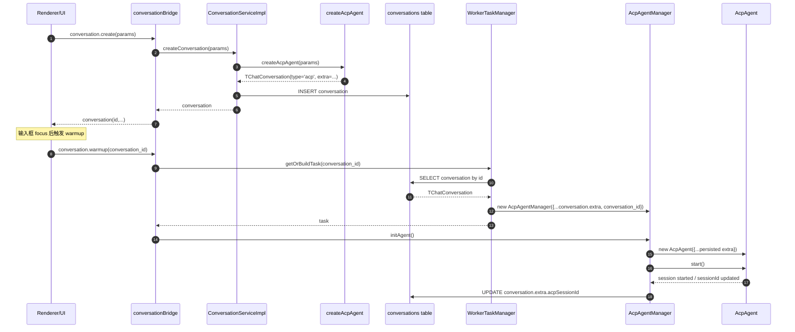
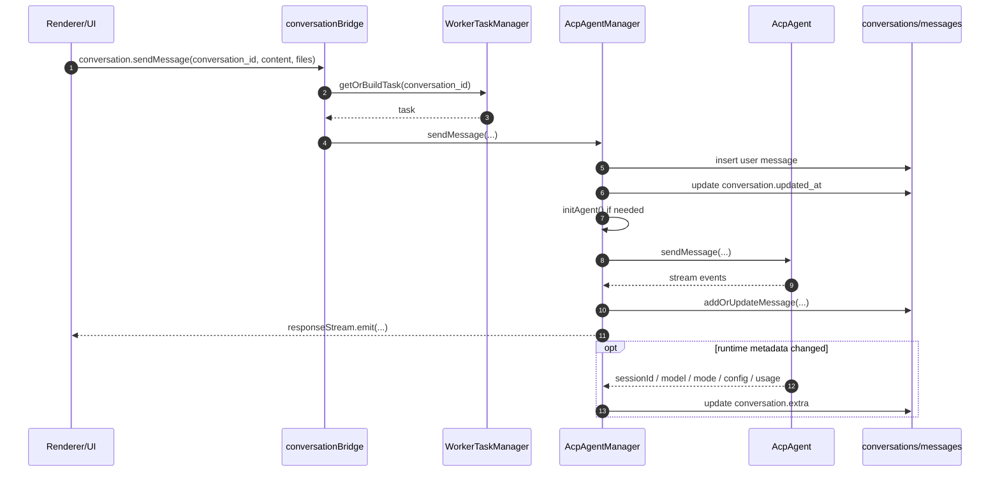
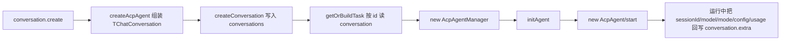

# ACP Conversation 与 Runtime 链路分析

> 日期：2026-04-12
> 状态：分析文档
> 范围：`conversation` 数据持久化、`AcpAgentManager` 构建、`AcpAgent` 初始化与运行时回写

---

## 一、目标

本文回答 4 个问题：

1. `AcpAgentManager.initAgent()` 返回的 `AcpAgent` 与数据库 `conversation` 是什么关系
2. `conversation` 在哪里写入
3. `conversation` 在什么时机写入
4. `conversation` 在什么时机读取

结论先行：

- `conversation` 是 **ACP 会话的持久化记录**
- `AcpAgentManager` 是 **基于 `conversation` 构建的运行时管理层**
- `AcpAgent` 是 **真正的 ACP/CLI session 实例**
- `initAgent()` **不会创建数据库记录**，它只是把已经存在的 `conversation` 转成运行中的 `AcpAgent`

---

## 二、三层模型

### 2.1 持久化层：`conversation`

ACP conversation 的核心字段存在 `TChatConversation<'acp'>['extra']` 中，包括：

- `backend`
- `workspace`
- `customWorkspace`
- `agentName`
- `customAgentId`
- `enabledSkills`
- `acpSessionId`
- `acpSessionUpdatedAt`
- `sessionMode`
- `currentModelId`
- `cachedConfigOptions`
- `pendingConfigOptions`

这些字段定义见：

- `src/common/config/storage.ts`

`conversation` 是 SQLite `conversations` 表中的一行，负责保存：

- 创建时的配置快照
- 会话列表展示所需元数据
- 页面切换/重启后的恢复信息
- 运行时增量状态，如 sessionId、mode、model、usage

### 2.2 管理层：`AcpAgentManager`

`AcpAgentManager` 由 `WorkerTaskManager` 按 `conversation.id` 惰性构建。它的输入并不是前端临时状态，而是数据库中的 `conversation`。

其职责是：

- 把 `conversation.extra` 映射成运行参数
- 管理 bootstrap / warmup / sendMessage
- 接收 ACP stream event
- 把 runtime 信息再写回 `conversation.extra`

### 2.3 运行时层：`AcpAgent`

`AcpAgent` 才是真正和 ACP backend / CLI 进程打交道的对象。

`AcpAgentManager.initAgent()` 的核心行为是：

- `new AcpAgent(...)`
- `agent.start()`
- 注册 sessionId / stream / signal 回调
- 在 session 建好后恢复持久化状态

所以这三层的关系可以概括成：

```text
conversation (DB snapshot)
  -> AcpAgentManager (runtime manager)
  -> AcpAgent (live ACP session / CLI process)
```

---

## 三、创建与运行主链路

### 3.1 创建阶段：先生成 conversation，再落库

前端创建 ACP 会话时，走 `ipcBridge.conversation.create`：

1. Renderer 调用 `conversation.create`
2. `conversationBridge` 转发到 `conversationService.createConversation`
3. `ConversationServiceImpl.createConversation()` 调用 `createAcpAgent()`
4. `createAcpAgent()` 返回一个 `TChatConversation(type='acp')`
5. `repo.createConversation(finalConversation)` 写入 SQLite `conversations` 表

这一步只创建了 **持久化记录**，还没有真正启动 ACP runtime。

### 3.2 构建阶段：按 conversation 反查并构建 task

当需要真正使用会话时，例如：

- 页面 warmup
- 用户发送消息
- 切换 mode / model

系统会调用 `workerTaskManager.getOrBuildTask(conversation_id)`：

1. 先查内存缓存里是否已有 task
2. 如果没有，则从 repository 读取 `conversation`
3. 根据 `conversation.type === 'acp'` 调 `new AcpAgentManager({...c.extra, conversation_id: c.id})`
4. 把 task 缓存到 `WorkerTaskManager`

所以 `AcpAgentManager` 的构造参数本质上是：

```text
conversation.id + conversation.extra + 少量 build options
```

### 3.3 初始化阶段：`initAgent()` 才创建 `AcpAgent`

`AcpAgentManager.initAgent()` 做的事是：

1. 基于 manager 当前持有的 options 解析 CLI 配置
2. `new AcpAgent({...})`
3. 把 `conversation_id` 作为 agent id
4. 把 `workspace/backend/acpSessionId/sessionMode/currentModelId/...` 传给 agent
5. `agent.start()`
6. 注册回调，在运行时把 session 信息再写回数据库

这里非常重要的一点是：

- `initAgent()` 依赖的是已经存在的 `conversation`
- `initAgent()` 本身不负责创建 `conversation`

---

## 四、主时序图

### 4.1 创建 conversation -> warmup -> initAgent



### 4.2 用户发消息 -> stream -> runtime 回写



---

## 五、`conversation` 写入点与写入时机

### 5.1 首次写入：创建会话时

首次写入发生在 `ConversationServiceImpl.createConversation()`：

- `createAcpAgent()` 先组装 `TChatConversation`
- `repo.createConversation(finalConversation)` 写库

底层对应 SQLite：

```sql
INSERT INTO conversations (id, user_id, name, type, extra, model, status, source, channel_chat_id, created_at, updated_at)
VALUES (?, ?, ?, ?, ?, ?, ?, ?, ?, ?, ?)
```

这一步是 `conversation` 的出生点。

### 5.2 发送消息时：刷新会话更新时间

用户发送消息后，`AcpAgentManager.sendMessage()` 会：

1. 先写入用户消息
2. 再执行 `updateConversation(this.conversation_id, {})`

这里看起来是“空更新”，但实际上会触发：

- `modifyTime = Date.now()`
- `updated_at` 刷新

作用是让会话列表按最新活跃时间重新排序。

### 5.3 运行中：把 runtime 状态回写到 `conversation.extra`

`AcpAgentManager` 在 runtime 中会持续把增量状态写回 DB。

主要包括：

- `acpSessionId`
- `acpSessionUpdatedAt`
- `currentModelId`
- `sessionMode`
- `cachedConfigOptions`
- `lastTokenUsage`
- `lastContextLimit`

这些写入并不是创建会话时发生，而是在 session 已启动、或用户切换 model/mode、或收到 ACP stream event 后发生。

---

## 六、`conversation` 读取点与读取时机

### 6.1 会话列表读取

Renderer 的历史记录/侧边栏使用 `ipcBridge.database.getUserConversations` 读取 conversation 列表。

`databaseBridge` 的策略是：

- 优先从数据库读取
- 若存在旧 file storage 中尚未迁移的记录，则做懒迁移
- 合并后按 `modifyTime/createdTime` 排序返回

这意味着当前展示层把数据库作为主数据源。

### 6.2 单个 conversation 读取

`ipcBridge.conversation.get` 会：

1. 先从 `conversationService.getConversation(id)` 读取数据库
2. 如果 DB 中没有，则回退到旧 `chat.history`
3. 命中旧数据时后台触发迁移

### 6.3 构建 runtime task 时读取

这是最关键的读取时机。

无论是：

- `conversation.warmup`
- `conversation.sendMessage`
- 某些 mode/model 相关调用

最终都会走 `workerTaskManager.getOrBuildTask(conversation_id)`。这一步会：

1. 根据 `conversation_id` 读取 DB
2. 用这条 conversation 构建 `AcpAgentManager`
3. 后续再由 manager 初始化 `AcpAgent`

也就是说，**运行时对象是从 conversation 反向恢复出来的**。

---

## 七、字段映射：谁写、谁读

| 字段 | 首次来源 | 读取方 | 回写方 | 说明 |
| --- | --- | --- | --- | --- |
| `extra.backend` | 创建会话参数 | `AcpAgentManager.initAgent()` | 基本不回写 | 决定连接哪个 ACP backend |
| `extra.workspace` | 创建会话参数 | `AcpAgentManager.initAgent()` | 基本不回写 | 决定运行目录 |
| `extra.sessionMode` | Guid/创建参数 | `AcpAgentManager` 构造、`initAgent()` | `saveSessionMode()` | 会话模式持久化 |
| `extra.currentModelId` | Guid/创建参数 | `AcpAgentManager` 构造、`initAgent()` | `saveModelId()` | 当前模型恢复 |
| `extra.acpSessionId` | 无 | `initAgent()` 传给 `AcpAgent` | `saveAcpSessionId()` | session resume |
| `extra.cachedConfigOptions` | 无或 Guid 注入 | renderer / manager | `saveConfigOptions()` | 前端配置项缓存 |
| `extra.pendingConfigOptions` | Guid 注入 | `initAgent()` | 运行中消费后不一定回写 | 首次 session 创建后的待应用配置 |
| `extra.lastTokenUsage` | 无 | renderer 恢复展示 | `saveContextUsage()` | 上次上下文使用量 |
| `extra.lastContextLimit` | 无 | renderer 恢复展示 | `saveContextUsage()` | 上下文窗口大小 |

---

## 八、关键实现锚点

### 8.1 创建与写库

- `src/process/bridge/conversationBridge.ts`
  - `conversation.create.provider(...)`
- `src/process/services/ConversationServiceImpl.ts`
  - `createConversation(...)`
- `src/process/utils/initAgent.ts`
  - `createAcpAgent(...)`
- `src/process/services/database/index.ts`
  - `createConversation(...)`

### 8.2 从 conversation 构建 runtime

- `src/process/task/WorkerTaskManager.ts`
  - `getOrBuildTask(...)`
- `src/process/task/workerTaskManagerSingleton.ts`
  - `agentFactory.register('acp', ...)`

### 8.3 初始化 `AcpAgent`

- `src/process/task/AcpAgentManager.ts`
  - `initAgent(...)`

### 8.4 运行中回写 `conversation.extra`

- `src/process/task/AcpAgentManager.ts`
  - `saveAcpSessionId(...)`
  - `saveModelId(...)`
  - `saveSessionMode(...)`
  - `saveConfigOptions(...)`
  - `saveContextUsage(...)`

### 8.5 列表与详情读取

- `src/process/bridge/databaseBridge.ts`
  - `database.getUserConversations.provider(...)`
- `src/process/bridge/conversationBridge.ts`
  - `conversation.get.provider(...)`

---

## 九、最重要的结论

### 9.1 `initAgent()` 不是“建会话”，而是“起 runtime”

很多时候容易把 `initAgent()` 理解成“初始化一整个 ACP 会话”。更准确的说法是：

- `conversation.create` 负责创建并持久化会话记录
- `getOrBuildTask` 负责按记录恢复 manager
- `initAgent()` 负责真正启动 live ACP session

### 9.2 `conversation` 是 source of truth，runtime 是可重建的

对 ACP 来说，`conversation` 更像是：

- runtime 的配置快照
- 恢复点
- UI 展示状态源

而 `AcpAgentManager` / `AcpAgent` 都是可以按需重建的。

### 9.3 这也是 warmup 能成立的前提

warmup 不需要重新创建 conversation，它只需要：

1. 根据 `conversation_id` 读出记录
2. 构建 `AcpAgentManager`
3. 提前调用 `initAgent()`

因此 warmup 本质上是“提前把 runtime 拉起来”，不是“提前创建 conversation”。

---

## 十、补充：最简流程图



