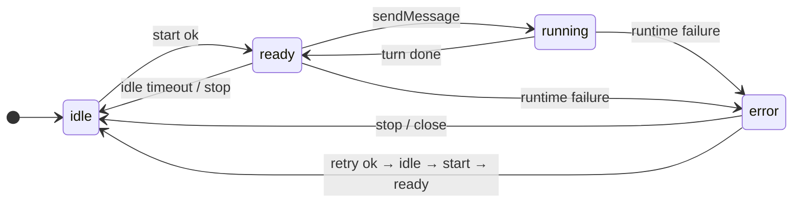

# Unified State Machine & Config Persistence

> 基于 WorkerTaskManager vs AcpRuntime/AcpSession 的对比分析
> 2026-04-20

---

## 背景：两套并行系统

当前代码库存在两套独立的会话管理系统，各自有状态机、idle 回收、配置恢复：

| 维度       | WorkerTaskManager (生产)                            | AcpRuntime/AcpSession (重构)             |
| ---------- | --------------------------------------------------- | ---------------------------------------- |
| 状态类型   | `AgentStatus`: `pending` \| `running` \| `finished` | `SessionStatus`: 7 态 FSM                |
| 时间戳字段 | `lastActivityAt`                                    | `lastActiveAt`                           |
| Idle 回收  | `killIdleCliAgents()` 内联在 WTM                    | `IdleReclaimer` 独立类                   |
| 回收动作   | kill（杀进程 + 从 taskList 移除）                   | suspend（杀进程 + 保留在 Map）           |
| 配置恢复   | `restorePersistedState()` 只恢复 mode/model         | `reassertConfig()` 用 ConfigTracker diff |
| 内存管理   | 干净（kill 后移除）                                 | 泄漏（suspend 后 Map 只增不减）          |

两套系统不互通，底层做的是同一件事（spawn → initialize → tryLoadOrCreate）。

---

## 问题分析

### 7 态 FSM 混了层

```
SessionStatus = 'idle' | 'starting' | 'active' | 'prompting' | 'suspended' | 'resuming' | 'error'
```

AcpRuntime 自己写了 `toStableStatus()`（已注释）承认只需要 4 个：

```ts
// idle → idle
// starting | active | prompting | resuming → active
// suspended → suspended
// error → error
```

进一步分析，7 态中有 3 个是内部过渡态，不应出现在顶层状态机：

| 状态        | 实际归属         | 为什么不该在顶层                                  |
| ----------- | ---------------- | ------------------------------------------------- |
| `starting`  | SessionLifecycle | "正在 spawn + initialize"——上层只关心成功还是失败 |
| `resuming`  | SessionLifecycle | 和 `starting` 同理，"正在重连"                    |
| `prompting` | PromptExecutor   | "一轮对话正在执行中"——是 `active` 的子状态        |

### `suspended` 不需要是独立状态

`suspended` 存在的唯一价值是"进程杀了但内存里保留 AcpSession 实例，以便 resume() 精确恢复 ConfigTracker diff"。

但如果 desired/current config 落盘了，kill + rebuild 就能做到同样精确的恢复。
`suspended` 退化为 `idle + sessionId !== null`，不需要独立状态。

### `finished` 和 `active` 的命名问题

两者语义相同——"当前轮次结束，进程还活着，等待下一次输入"。但：

- `finished` 命名从轮次视角，暗示"结束了，可以清理"
- `active` 命名从进程视角，暗示"活跃中，别动"

两个名字都有误导。更准确的名字是 **`ready`**——"就绪，可接受输入，超时可回收"。

### Config 持久化缺口

ConfigTracker 追踪 desired（用户意图）和 current（agent 确认），但 desired 完全不落盘：

| ConfigTracker 状态    | 落盘?                                    | 恢复?                          |
| --------------------- | ---------------------------------------- | ------------------------------ |
| current model         | `conversation.extra.currentModelId`      | `restorePersistedState()` 恢复 |
| current mode          | `conversation.extra.sessionMode`         | `restorePersistedState()` 恢复 |
| current configOptions | `conversation.extra.cachedConfigOptions` | **不重新 apply，只给 UI 展示** |
| desired model         | **不落盘**                               | 丢失                           |
| desired mode          | **不落盘**                               | 丢失                           |
| desired configOptions | **不落盘**                               | 丢失                           |

这意味着：用户切了 model/mode 但 agent 还没确认，这时进程被 kill，用户的选择就丢了。

---

## 统一方案

### 外部状态：4 态



| 状态      | 语义                                      | Runtime 行为                        | UI 表现                  |
| --------- | ----------------------------------------- | ----------------------------------- | ------------------------ |
| `idle`    | 无活跃进程（未启动 / 已停止 / 已回收）    | 不需要 teardown，下次交互时 rebuild | 离线 / 可用              |
| `ready`   | 进程存活，轮次间就绪，可发消息            | idle 检查的目标，超时后 kill → idle | 在线                     |
| `running` | 进程存活，正在执行当前轮次                | 不可被 idle kill                    | 正在思考/写代码/调用工具 |
| `error`   | 失败，阻止 sendMessage，允许 start() 重试 | 不回收                              | 错误 + 重试按钮          |

**不再需要 `suspended`**：desired/current 落盘后，`idle` + `sessionId !== null` 等效于 suspended。
rebuild 时从 DB 恢复 diff，走 `reassertConfig()` 精确恢复，效果等同于原来的 `resume()`。

**保留 `running`**：`ActivitySnapshotBuilder` 等 6 个 AgentManager 实现和 4 个外部消费者
都依赖 `running` 来区分"正在执行"和"等待输入"。这不是内部过渡态——Runtime 层确实需要知道
agent 是否在忙，用于 UI 展示（thinking/writing/tool-use）和防止 idle kill。

### 内部状态：各组件自管

| 组件             | 内部标志              | 覆盖旧状态              | 对外暴露                              |
| ---------------- | --------------------- | ----------------------- | ------------------------------------- |
| SessionLifecycle | `connecting: boolean` | `starting` / `resuming` | callback 通知 UI 显示 loading（可选） |

`prompting` 不再需要下沉——它就是外部的 `running`。
`starting` / `resuming` 是真正的内部过渡态，上层不需要区分"正在首次连接"还是"正在重连"。

### 与旧系统的映射

| 旧 AgentStatus | 新统一状态 | 变化   |
| -------------- | ---------- | ------ |
| `pending`      | `idle`     | 重命名 |
| `running`      | `running`  | 不变   |
| `finished`     | `ready`    | 重命名 |
| _(无)_         | `error`    | 新增   |

| 旧 SessionStatus | 新统一状态                                            |
| ---------------- | ----------------------------------------------------- |
| `idle`           | `idle`                                                |
| `starting`       | `idle`（内部 SessionLifecycle.connecting = true）     |
| `active`         | `ready`                                               |
| `prompting`      | `running`                                             |
| `suspended`      | `idle`（DB 有 sessionId，rebuild 时自动 loadSession） |
| `resuming`       | `idle`（内部 SessionLifecycle.connecting = true）     |
| `error`          | `error`                                               |

### 对现有代码的影响

AgentStatus 类型变更：`'pending' | 'running' | 'finished'` → `'idle' | 'running' | 'ready' | 'error'`

受影响的消费者：

| 消费者                                           | 当前用法                             | 改动                               |
| ------------------------------------------------ | ------------------------------------ | ---------------------------------- |
| `WorkerTaskManager.killIdleCliAgents`            | `=== 'finished'`                     | → `=== 'ready'`                    |
| `conversationBridge.get`                         | `\|\| 'finished'` fallback           | → `\|\| 'ready'`                   |
| `ActivitySnapshotBuilder.normalizeRuntimeStatus` | 白名单 `pending/running/finished`    | → `idle/running/ready`，加 `error` |
| `ActivitySnapshotBuilder.mapStatusToState`       | `pending` → syncing                  | → `idle` → syncing                 |
| `ActivitySnapshotBuilder` 优先级排序             | `running > pending > finished`       | → `running > idle > ready`         |
| `ConversationTurnCompletionService`              | `?? 'finished'` fallback             | → `?? 'ready'`                     |
| 6 个 AgentManager 子类                           | `this.status = 'pending'/'finished'` | → `'idle'`/`'ready'`               |

---

## Config 持久化方案

### ConfigTracker 不变

ConfigTracker 保持纯内存设计——追踪 desired/current，通过 snapshot 暴露。
它不知道 DB 的存在，持久化责任在上层（Conversation 层）。

### 上层负责落盘

```
用户操作 setModel("gpt-4o")
  → ConfigTracker.setDesiredModel("gpt-4o")           // 内存
  → 上层写 DB: extra.desiredModelId = "gpt-4o"        // 落盘
  → agent 确认
  → ConfigTracker.setCurrentModel("gpt-4o")            // 内存：desired 清空
  → 上层写 DB: extra.currentModelId = "gpt-4o"         // 落盘
                extra.desiredModelId = null              // 落盘：desired 清空
```

### DB schema 变更

`conversation.extra` 增加 desired 字段：

| 字段                   | 类型                                        | 说明                                       |
| ---------------------- | ------------------------------------------- | ------------------------------------------ |
| `desiredModelId`       | `string \| null`                            | 用户选择但未被 agent 确认的 model          |
| `desiredModeId`        | `string \| null`                            | 用户选择但未被 agent 确认的 mode           |
| `desiredConfigOptions` | `Record<string, string \| boolean> \| null` | 用户设置但未被 agent 确认的 config options |

现有字段（`currentModelId`, `sessionMode`, `cachedConfigOptions`）继续使用，语义不变。

### Rebuild 时恢复流程

```
getOrBuildTask(convId)
  → cache miss（agent 已被 idle kill）
  → 从 DB 读取 conversation（含 desired + current）
  → new AgentSession(config, {
      initialDesired: {
        model: extra.desiredModelId,
        mode: extra.desiredModeId,
        configOptions: extra.desiredConfigOptions,
      }
    })
  → ConfigTracker 初始化时接收 initialDesired
  → spawn + initialize + tryLoadOrCreate(acpSessionId)
  → reassertConfig(configTracker.getPendingChanges())
    → desired model != current? → setModel()
    → desired mode != current? → setMode()
    → desired configOptions diff? → setConfigOption() each
```

`restorePersistedState()` 应补全 configOptions 的重新 apply，不能只靠 `loadSession` 碰运气。

---

## 对架构的影响

### IdleReclaimer 移除

IdleReclaimer 的存在价值是"保留内存状态以便精确 resume"。
desired/current 落盘后，WTM 的 idle kill + rebuild 就是更好的方案：

- 无内存泄漏（kill 后从 map 移除）
- 有 cronBusyGuard（不误杀正在执行定时任务的 agent）
- 超时可动态配置（`ProcessConfig.get('acp.agentIdleTimeout')`）
- 恢复质量等同于 resume（从 DB 重建 ConfigTracker diff）

### Registry 层变更

| 原方案                   | 新方案                                       |
| ------------------------ | -------------------------------------------- |
| idle 回收加 suspend 语义 | idle 回收直接 kill + 从 map 移除（现有行为） |
| `supportsSuspend()` 接口 | 不需要，统一 kill                            |

### Agent 层变更

| 原方案                        | 新方案                                                               |
| ----------------------------- | -------------------------------------------------------------------- |
| 7 态 FSM                      | 4 态（`idle` \| `running` \| `ready` \| `error`）                    |
| `suspend()` / `resume()` 方法 | 移除，`stop()` 回到 idle 即可                                        |
| 内部过渡态在 SessionStatus    | `starting`/`resuming` 下沉为 SessionLifecycle 内部 `connecting` 标志 |

### Conversation 层变更

| 新增职责                       | 说明                                            |
| ------------------------------ | ----------------------------------------------- |
| 订阅 ConfigTracker 变化，写 DB | desired/current 的每次变化都持久化              |
| rebuild 时传入 initialDesired  | 从 DB 读取 desired，注入 ConfigTracker 构造函数 |
| `reassertConfig()` 补全        | configOptions 也要重新 apply                    |

---

## 统一后的架构总览

```
Runtime (WorkerTaskManager)
  ├─ taskMap: Map<convId, AgentSession>
  ├─ idleCheck(): status === 'ready' && idle timeout → kill + 从 map 移除
  ├─ getOrBuild(convId): cache miss → 从 DB 重建 → reassertConfig
  └─ cronBusyGuard: 保护正在执行定时任务的 session

AgentSession (统一的 Session)
  ├─ status: 'idle' | 'running' | 'ready' | 'error'  ← 4 态，对外
  ├─ configTracker: ConfigTracker                      ← 纯内存 desired/current
  ├─ lifecycle: SessionLifecycle                       ← 内部管 connecting
  └─ promptExecutor: PromptExecutor                    ← 设 running/ready

DB (conversation.extra)
  ├─ currentModelId, desiredModelId
  ├─ currentModeId (sessionMode), desiredModeId
  ├─ currentConfigOptions (cachedConfigOptions), desiredConfigOptions
  └─ acpSessionId                                      ← tryLoadOrCreate 用
```

4 态 + 落盘 desired/current = 不需要 `suspended`，不需要 `IdleReclaimer`，不需要保留内存对象图，恢复质量等同于 resume。
